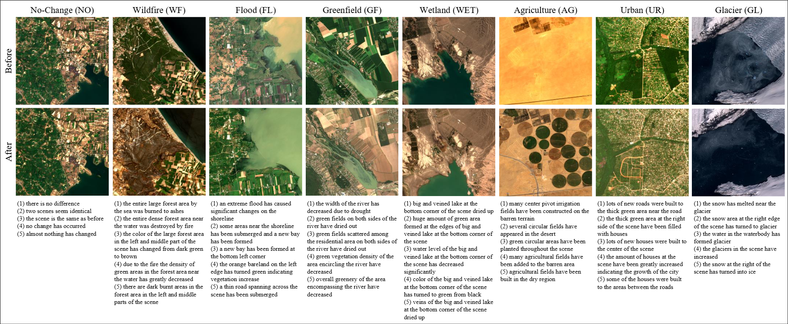

# Introducing MOSAIC-SEN2-CC: A Multispectral Dataset and Adaptation Framework for Remote Sensing Change Captioning


📢 **This paper is published in IEEE Journal of Selected Topics in Applied Earth Observations and Remote Sensing (JSTARS), 2025.**  
🔗 [IEEE Xplore Link]([https://ieeexplore.ieee.org/stamp/stamp.jsp?tp=&arnumber=11130644](https://ieeexplore.ieee.org/document/11181102/))  
📄 DOI: [10.1109/JSTARS.2025.3615113](https://doi.org/10.1109/JSTARS.2025.3600613) \
\
🌐 [**MOSAIC Research Group Website**](https://avesis.yildiz.edu.tr/arastirma-grubu/mosaic)

## 🔎 Summary
The paper introduces multispectral change captioning for remote sensing, a task not previously explored beyond RGB images. It presents the **MOSAIC-SEN2-CC dataset** with Sentinel-2 image pairs and captions across multiple change categories. A new **MSICC** framework leveraging BigEarthNet features and a transformer decoder is proposed, and existing methods are adapted to multispectral data. Results show that using spectral information improves change captioning performance.

---

You can view a sample visualization and MOSAIC dataset overview in the document below:
<p align="center">
  
</p>


DOI: 
[]()
[]()
[](https://doi.org/10.1109/JSTARS.2025.3615113)
---

⭐ **Share us a star if this repo helps your research!**  

🔥 Our new work on **change captioning and multimodal reasoning** is continuously updated here. Stay tuned! 🔥

---

## 📘 MOSAIC-SEN2-CC Dataset
We introduce **MOSAIC-SEN2-CC**, a multispectral remote sensing change captioning dataset.

- [Download Link (Google Drive)](https://drive.google.com/drive/folders/1cNaJ6XH9tBe1uvNirwy-l9leKlgAAkOn?usp=sharing)
- [Download Link (Zenodo, DOI: [10.5281/zenodo.19677262](http://dx.doi.org/10.5281/zenodo.19677262))
- Train / Val / Test splits provided with 10 Sentinel 2 multispectral band images
- Includes paired images + change captions

## ⚙️ Installation and Dependencies
```bash
cd MOSAIC-SEN2-CC
conda create -n mosaiccc_env python=3.10
conda activate mosaiccc_env
pip install -r requirements.txt
```


## 📊 Evaluation Metrics

For evaluation, we use standard captioning metrics: **BLEU, CIDEr, ROUGE-L, METEOR, and SPICE**.

Due to GitHub storage limitations, the `eval_func/meteor` and `eval_func/spice` subfolders are **not included** in this repository.  
You can download them from Google Drive:

- [METEOR & SPICE Evaluation Scripts (Google Drive)](https://drive.google.com/file/d/1GseNGhs2qhIW6G72fktrWckbTaZ98vws/view?usp=sharing)

After downloading, place them under:
```bash
./eval_func/
├── bleu/
├── cider/
├── rouge/
├── meteor/
└── spice/
```

---
## 📂 Data Preparation

### Download the Dataset
Download **MOSAIC-SEN2-CC** dataset from Google Drive:

- [MOSAIC-SEN2-CC Dataset (Google Drive)](https://drive.google.com/drive/folders/1cNaJ6XH9tBe1uvNirwy-l9leKlgAAkOn?usp=sharing)
- [MOSAIC-SEN2-CC Dataset (Zenodo)] (http://dx.doi.org/10.5281/zenodo.19677262))

---

## 🔎 Inference Demo

You can download our pretrained model checkpoint: [Google Drive](https://drive.google.com/file/d/1I9uxZI6P99J-8GcFMGN3_vHPEZMAZEyR/view?usp=sharing)

After downloading, put the checkpoint into:
./checkpoint/


Run demo:
```bash
cd .\RSICCformer_MS_BigEarthNet\

python .\eval_changed.py 
--data_folder ../MOSAIC-SEN2-CC/ 
--data_name MOSAIC-SEN2-CC_5_cap_per_img_5_min_word_freq 
--encoder_image resnet101 
--Split TEST 
--beam_size 1 
--path  training_model_checkpoint_save_path/model_dir 
--terminal_output   training_model_checkpoint_save_path/model_dir 
```
Generated captions will be saved in the workspace as well as ground truth captions.

---

## 🏋️ Training 

Make sure the dataset is downloaded. Download BigEarthNet pretrained ResNet101 backbone checkpoint from here: [Google Drive](https://drive.google.com/file/d/1oGw9P4SzaYBoiJl11YMd3m-fGCmEm6sN/view?usp=sharing)

After downloading, put the pretrained BigEarthnet encoder backbone into:
./BigEarthnetModels/


Then run:

Run training:
```bash
cd .\RSICCformer_MS_BigEarthNet\

python .\train_changed_withNC.py 
--data_folder ../MOSAIC-SEN2-CC/ 
--data_name MOSAIC-SEN2-CC_5_cap_per_img_5_min_word_freq 
--encoder_image resnet101 
--epochs 30 
--batch_size 16 
--encoder_lr 5e-5 
--decoder_lr 5e-5 
--fine_tune_encoder True
--beam_size 1

```
  
---

## 📑 Citation

If you find our work useful, please cite:
```bash

@ARTICLE{karaca2025robust,
  author={Busra Tuzlupinar, Enes Ozelbas, Mehmet Fatih Amasyali, Ali Can Karaca},
  journal={IEEE Journal of Selected Topics in Applied Earth Observations and Remote Sensing}, 
  title={Introducing MOSAIC-SEN2-CC: A Multispectral Dataset and Adaptation Framework for Remote Sensing Change Captioning}, 
  year={2025},
  volume={18},
  number={},
  pages={25410-25426},
  doi={10.1109/JSTARS.2025.3615113}}

 
```

---

## 🙏 Reference

We thank the following repositories:

- [a-PyTorch-Tutorial-to-Image-Captioning](https://github.com/sgrvinod/a-PyTorch-Tutorial-to-Image-Captioning)

- [RSICCformer (Liu et al., TGRS 2022)](https://github.com/Chen-Yang-Liu/RSICC)


